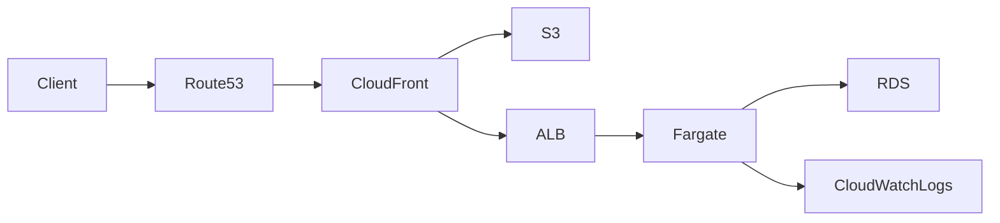
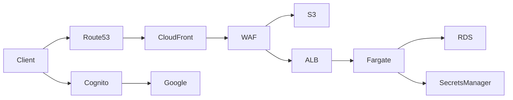
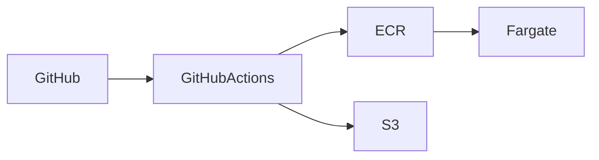

# 🎨 PlasticModelApp.Public 🤖

x29general のポートフォリオ "PlasticModelApp" 公開用リポジトリ。

## 1. 概要

**PlasticModelApp** は、プラモデル製作を支援することを目的とした Web アプリケーションです。塗料検索、類似色検索、各種マスタ参照を通じて、制作時の意思決定を支援します。

本リポジトリはポートフォリオ用途として公開しており、以下を主目的としています。

- ASP.NET Core を用いた Web API 設計
- Blazor WebAssembly / React による SPA フロントエンド
- PostgreSQL を用いたデータ設計
- AWS 上での最小構成から段階的に拡張するインフラ設計
- 必要に応じた Cognito + Google IdP 認証設計

関連設計ドキュメント:

- [システムアーキテクチャ](docs/20_design/01_architecture/01_system_architecture.md)
- [AWS インフラ設計](docs/20_design/01_architecture/03_aws_infrastructure_architecture.md)

---

## 2. アーキテクチャ

### Minimum Architecture



### Extended Architecture



### Deployment Overview



---

## 3. 技術スタック

### 最小構成

| Layer | Technology |
| ------ | ------ |
| Frontend | Blazor WebAssembly / React |
| Backend | ASP.NET Core Web API |
| Language | C# |
| Database | PostgreSQL |
| ORM | Entity Framework Core |
| Container | Docker |
| Infra | AWS (Route 53 / CloudFront / S3 / ALB / ECS Fargate / RDS) |
| Logs | CloudWatch Logs |
| CI/CD | GitHub Actions |

### 拡張構成

| Layer | Technology |
| ------ | ------ |
| Auth | Cognito + Google IdP + JWT |
| Secrets | Secrets Manager / SSM Parameter Store |
| Security | AWS WAF |
| Monitoring | CloudWatch / CloudTrail |
| IaC | Terraform |

---

## 4. 認証方針

- 最小構成では認証を必須としない
- 認証が必要になった段階で Cognito User Pool を導入する
- Google アカウントログインは Cognito から Google IdP へフェデレーションする
- API は拡張段階で Cognito が発行した JWT を検証して認可する

---

## 5. 設計ポリシー

本アプリケーションは以下の設計方針を意識して実装しています。

- オニオンアーキテクチャ
- ドメインモデル中心設計
- 責務分離（Controller / Application / Domain / Infrastructure）
- 学習目的に合わせた最小構成優先
- 必要になったときだけ AWS サービスを段階的に追加

---

## 6. DB 設計

主要テーブル構成:

- Paints
- Brands
- Glosses
- Tags
- PaintTags（中間）

設計方針:

- 検索性能を考慮したインデックス付与
- ソート用モデル番号分解カラム
- 外部キー制約による整合性担保

ER 図やテーブル詳細は `docs/20_design/02_data` を参照。

---

## 7. API エンドポイント（一部）

| Method | Path | Description |
| ------ | ------ | ------ |
| GET | /healthz | API ヘルスチェック |
| GET | /health/db | DB ヘルスチェック |
| POST | /api/paints/search | 塗料検索 |
| POST | /api/paints/color-search | 類似色検索 |
| GET | /api/paints/{id} | 塗料詳細取得 |
| GET | /api/masters | 検索用マスタ取得 |

詳細は [API 定義](docs/20_design/03_api/api.yml) を参照。

---

## 8. 非機能要件

### 最小構成

- 構造化ログ出力
- 例外ハンドリング統一
- CORS 制御
- CloudWatch Logs によるログ収集

### 拡張構成

- Cognito JWT による API 保護
- CloudWatch ベースの監視強化
- 将来的なレート制限導入
- 複数 AZ を前提とした可用性向上

---

## 9. インフラ / デプロイ

### 最小構成

- Frontend: S3 + CloudFront
- API: ALB + ECS on Fargate
- DB: RDS for PostgreSQL
- Logs: CloudWatch Logs
- CI/CD: GitHub Actions

### 拡張構成

- Auth: Cognito User Pool + Google IdP
- Secrets: Secrets Manager / SSM Parameter Store
- Security: AWS WAF
- Monitoring: CloudWatch / CloudTrail
- IaC: Terraform

### デプロイ概要

- Frontend のビルド成果物を S3 へ配置
- API の Docker イメージを ECR へ push
- ECS Service を更新して API をデプロイ
- 必要に応じて CloudFront キャッシュを無効化

---

## 10. ローカル開発環境

### 必須

- .NET SDK
- Node.js（フロントエンド補助用途がある場合）
- PostgreSQL
- Docker（API のコンテナ動作確認を行う場合）

### セットアップ例

```bash
git clone <repo>
cd <repo>

# DB migration
dotnet ef database update

# Run API
dotnet run

# Run frontend
dotnet run
```

実際の実装構成に応じた起動手順は今後整理予定。

---

## 11. Roadmap

- 最小構成での AWS 公開
- Cognito 認証基盤の導入
- React フロントエンド検証
- 検索性能最適化
- キャッシュ導入
- Terraform による IaC 整備
