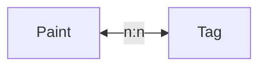

# BC2: Catalog

Catalogコンテキストのドメインモデリング。

## 1. 集約とポリシーの表現

| ID | 名称 | 説明 |
| - | - | - |
| AR1 | Paint | 塗料のデータ。 |
| AR2 | Tag | 本アプリで定義した、塗料をラベリングするためのタグ。 |

## 2. ビジネスルールの具体化

### 2.1. AR1: Paint

- 塗料に関するデータを保持する。
- 保持する属性の詳細は 3. 必要なインプットの特定 セクションで定義する。

### 2.2. AR2: Tag

- 本アプリで定義した、塗料を分類しラベリングするための機能を提供する。
- タグを分類するためのタグカテゴリーを保持する。
- 保持する属性の詳細は 3. 必要なインプットの特定 セクションで定義する。

## 3. 必要なインプットの特定

### 3.1. AR1: Paint

| 名称 | 説明・ルール |
| - | - |
| PaintId | 塗料を一意に特定するための識別子。 |
| Name | 塗料の名称。 |
| ColorSpec | 色見本の値。HEX/RGB/HSLを保持する。 |
| HexColor | 色見本の値（HEX）。 `#RRGGBB`の形式。 |
| RgbColor | 色見本の値（RGB）。 `[R, G, B]`の形式。 それぞれ `0 ~ 255`の値。 |
| HslColor | 色見本の値（HSL）。 `[H, S, L]`の形式。Hは `0 ~ 360`、Sは `0 ~ 100`、Lは `0 ~ 100`。 |
| BrandId | 塗料のブランド。 |
| PaintTypeId | 塗料の種類（ラッカー/エナメル/水性など）。 |
| GlossId | 光沢（光沢/半光沢/つや消しなど）。 |
| ModelNumber | 型式番号。 |
| Price | 塗料の価格。 日本円、消費税抜き。|
| Net | 塗料の内容量。 単位はml。 |
| ImageUrl | 塗料の画像URL。 |

### 3.2. AR2: Tag

| 名称 | 説明・ルール |
| - | - |
| TagId | タグを一意に特定するための識別子。 |
| Name | タグの名称。 |
| TagCategoryId | タグカテゴリーを一意に特定するための識別子。 |

## 4. アウトプットの明確化

| ID | 名称 | 説明・ルール |
| - | - | - |
| OP1 | PaintSummary | 塗料の概要を示す必要最小限のアウトプット。塗料名、ブランド、色見本、基準色との距離（類似色検索の場合）を保持する。 |
| OP2 | PaintDetail | 塗料の詳細な情報を示すアウトプット。 |

## 5. 集約間の関連性

PaintとTagは多対多の関係にある。
