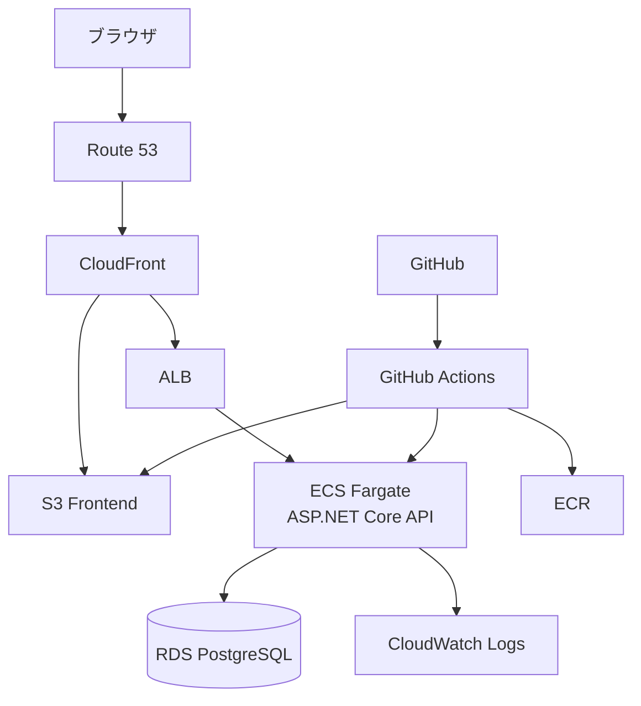
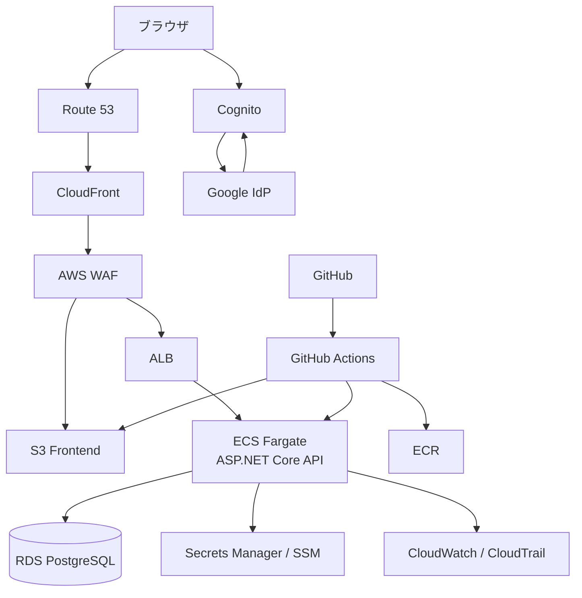

# システムアーキテクチャ

## 概要

PlasticModelApp は、フロントエンド、API、データベースを分離した Web アプリケーションとして構成する。
インフラは AWS を前提とするが、学習目的の個人開発であることを踏まえ、最小構成から開始し、必要に応じて段階的に拡張する。

詳細な AWS インフラ設計は [03_aws_infrastructure_architecture.md](./03_aws_infrastructure_architecture.md) を参照すること。

## 段階別の方針

### 最小構成

- Frontend: S3 + CloudFront
- API: ALB + ECS on Fargate
- Database: RDS for PostgreSQL
- Logs: CloudWatch Logs

### 拡張構成

- Cognito + Google IdP
- Secrets Manager / SSM Parameter Store
- AWS WAF
- CloudWatch Metrics / Alarm
- CloudTrail
- Terraform

## 採用技術

| 項目 | 技術 | バージョン | 目的 |
| ------ | ------ | ------------ | ------ |
| フロントエンド | Blazor WebAssembly / React | - | SPA UI |
| API | ASP.NET Core / .NET 10 | 10.0+ | Web API |
| コンテナ実行基盤 | ECS on Fargate | - | API 実行 |
| 負荷分散 | ALB | - | API ルーティング |
| データベース | PostgreSQL on RDS | 17.x | データ永続化 |
| CDN / 静的配信 | CloudFront + S3 | - | フロント配信 |
| ログ収集 | CloudWatch Logs | - | アプリログ収集 |
| 認証 | Cognito + Google IdP | - | 拡張段階のユーザー認証 |
| シークレット管理 | Secrets Manager / SSM Parameter Store | - | 拡張段階の機密情報・設定管理 |
| 監視 | CloudWatch / CloudTrail | - | 拡張段階の監視・監査 |
| CI/CD | GitHub Actions | - | ビルド・テスト・デプロイ |
| IaC | Terraform | - | 拡張段階の AWS リソース管理 |

## 全体構成

### 最小構成

### 拡張構成

## 認証・認可

- 最小構成では認証を必須としない
- 認証が必要になった段階で Cognito User Pool を導入する
- Google アカウントでのサインインは Cognito から Google IdP へフェデレーションする
- API は拡張段階で Cognito が発行した JWT を検証して認可を行う

## 配置方針

- フロントエンドは S3 に配置し、CloudFront 経由で配信する
- API は Docker 化し、ECS on Fargate で稼働させる
- API は ALB 経由で公開する
- データベースは RDS for PostgreSQL を利用する
- 初期段階ではログ収集を CloudWatch Logs のみに絞る

## 運用方針

- GitHub Actions によりビルド、テスト、デプロイを自動化する
- まずは最小構成を優先して公開する
- 認証、セキュリティ、監視強化、IaC は必要に応じて追加する
