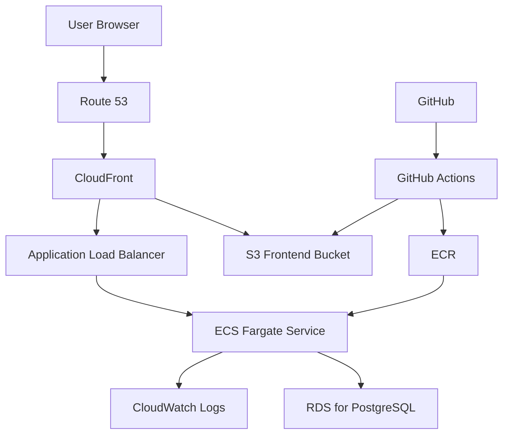
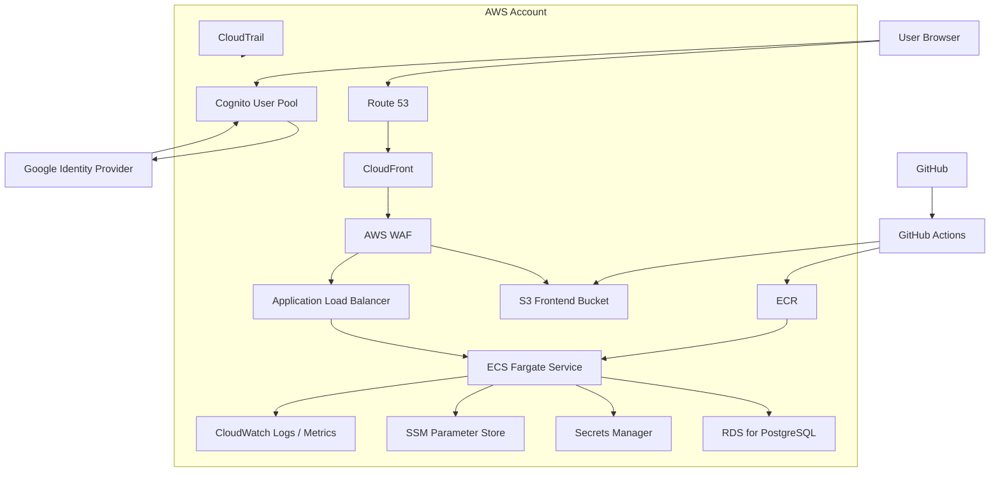
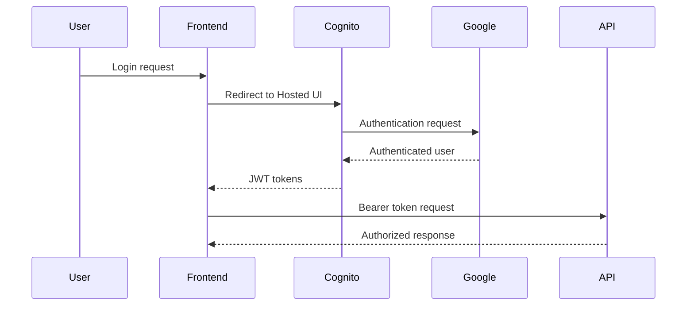

# AWSインフラ設計

## 1. 目的

本ドキュメントでは、PlasticModelApp を AWS 上で運用するためのインフラ構成を定義する。

本設計は、学習目的の個人開発であることを踏まえ、以下の 2 段階で構成する。

1. 最小構成: まずはアプリを公開し、基本的な AWS 構成を学ぶ
2. 拡張構成: 認証、セキュリティ、運用性を段階的に強化する

## 2. 設計方針

- 最初から AWS サービスを過剰に増やさない
- フロントエンドは静的配信とし、S3 + CloudFront を採用する
- API は Docker 化し、ECS on Fargate で動かす
- データベースは RDS for PostgreSQL を採用する
- 初期段階のログ収集は CloudWatch Logs に絞る
- 認証や周辺サービスは、必要性が出た段階で追加する

## 3. 段階別構成

### 3.1. 最小構成

最小構成では、以下のみを採用する。

- Route 53
- CloudFront
- S3
- ALB
- ECS on Fargate
- RDS for PostgreSQL
- CloudWatch Logs

### 最小構成図

### 3.2. 拡張構成

最小構成の上に、必要に応じて以下を追加する。

- Cognito User Pool
- Google IdP
- Secrets Manager
- SSM Parameter Store
- WAF
- CloudWatch Metrics / Alarm
- CloudTrail
- ECS Auto Scaling
- Terraform

### 拡張構成図

## 4. 採用サービス一覧

| 段階 | サービス | 用途 |
| ------ | ------ | ------ |
| 最小 | Route 53 | 独自ドメインの名前解決 |
| 最小 | CloudFront | フロント配信 |
| 最小 | S3 | フロントエンド静的ホスティング |
| 最小 | ALB | API ルーティング |
| 最小 | ECS on Fargate | API 実行 |
| 最小 | RDS for PostgreSQL | データ永続化 |
| 最小 | CloudWatch Logs | アプリログ収集 |
| 拡張 | Cognito User Pool | アプリ認証基盤 |
| 拡張 | Google IdP | ソーシャルログイン |
| 拡張 | Secrets Manager | 機密情報管理 |
| 拡張 | SSM Parameter Store | 設定値管理 |
| 拡張 | AWS WAF | セキュリティ強化 |
| 拡張 | CloudWatch Metrics / Alarm | 監視強化 |
| 拡張 | CloudTrail | 監査 |
| 拡張 | Terraform | IaC |

## 5. 最小構成の詳細

### 5.1. フロントエンド

- フロントエンドは S3 に配置する
- CloudFront を通して配信する
- SPA ルーティングに対応するため、`index.html` フォールバックを設定する

### 5.2. API

- API は ASP.NET Core Web API を Docker イメージ化する
- ECR にイメージを push し、ECS on Fargate で実行する
- API は ALB 経由でのみ公開する
- ヘルスチェックには `/healthz` を利用する

### 5.3. データベース

- RDS for PostgreSQL を利用する
- 学習用途の初期段階では、まず単一インスタンスで開始する
- バックアップ設定は有効化する

### 5.4. ログ

- 初期段階では CloudWatch Logs のみ利用する
- API のアプリケーションログを集約する
- メトリクスやアラームは拡張段階で追加する

### 5.5. デプロイ

- GitHub Actions でフロントエンドを S3 へ配置する
- GitHub Actions で API イメージを ECR へ push する
- ECS Service を更新して API をデプロイする

## 6. 最小構成のネットワーク方針

- API は ALB 経由で公開する
- RDS は直接公開しない
- 初期段階では、学習コストとのバランスを重視し、複雑な周辺構成は後回しにする

## 7. 拡張構成の詳細

### 7.1. Cognito + Google IdP

認証が必要になった段階で、以下を追加する。

- Cognito User Pool
- Cognito App Client
- Cognito Hosted UI
- Google IdP フェデレーション

この段階で、API は Cognito が発行した JWT を検証する構成へ移行する。

### 7.2. シークレット管理

設定が増えてきた段階で、以下を追加する。

- DB 接続文字列を Secrets Manager へ移行
- 環境ごとの設定値を SSM Parameter Store で管理

### 7.3. セキュリティと運用強化

必要に応じて以下を追加する。

- AWS WAF
- CloudWatch Metrics / Alarm
- CloudTrail
- ECS Auto Scaling

## 8. 認証フロー（拡張段階）

## 9. 画像アップロード機能の扱い

既存要件では、アップロード画像はサーバーへ永続保存しない。

- 画像の表示とクリック座標取得はフロントエンドで行う
- 色抽出も可能な限りフロントエンドで実行する
- API には抽出済みの RGB / HSV と検索条件のみ送る
- 初期段階では S3 への画像保存は行わない

## 10. 今後の拡張候補

- Cognito による認証導入
- WAF の追加
- Auto Scaling の追加
- Secrets Manager / SSM の追加
- Terraform による IaC 整備
- CloudWatch Alarm の追加
- CloudTrail の有効化

## 11. 推奨方針

PlasticModelApp のような学習目的の個人開発では、まずは以下の最小構成で公開するのが適切である。

- S3 + CloudFront
- ALB + ECS on Fargate
- RDS for PostgreSQL
- CloudWatch Logs

その後、アプリの成長や学習テーマに応じて、認証、セキュリティ、運用性を拡張する。
